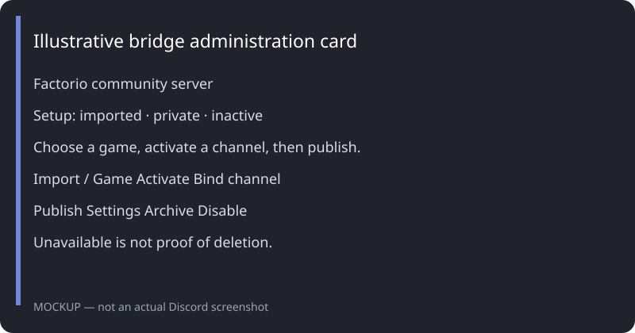
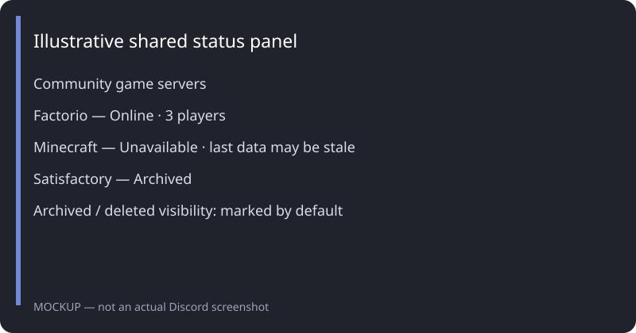

# Pterodactyl Platform Bridge

Manage Pterodactyl game servers from Discord, with optional KOOK mirroring. Live status panels, supported game chat relays, and idle auto-stop help community administrators run **Factorio, Minecraft, Satisfactory, and Source engine servers**.

**Public beta candidate:** release automation is prepared; a published image and live acceptance checks are required before calling this release ready. One installation supports one Discord guild and one Pterodactyl panel. All features are free under the [MIT License](LICENSE); donations are optional. No donation destination has been supplied.

## Quick start: Discord and Docker

Requirements: Docker Engine with Compose, a persistent volume, a Discord bot token, and network access from the host to Discord, the Panel and Wings/game endpoints. The public Compose file uses a **published, pinned** image from `ghcr.io/ttlouis/pterodactyl-discord-bridge-bot`.

1. Create a Discord application in the [Developer Portal](https://discord.com/developers/applications), add a bot, and copy its token into `.env`. Enable **Message Content Intent** before starting; the bridge currently requests it even when relay is disabled. The bridge requests Guilds, Guild Messages, Guild Message Reactions, and Message Content gateway intents.
2. Invite the application with `bot` and `applications.commands` scopes. Grant View Channels, Send Messages, Embed Links, Read Message History, Add Reactions, Manage Channels, and **Manage Roles** (needed to edit channel permission overwrites; see [Discord documentation](https://docs.discord.com/developers/resources/channel#edit-channel-permissions)). Setup must be performed by the guild owner or a Discord administrator. Check category overrides if channel creation or publication fails.
3. Obtain a Pterodactyl **Client API** key that can access the servers you want to manage. Allocation-read access is needed to discover public ports. Setup uses the panel URL, not the Wings URL.
4. Copy `.env.example` to `.env`, set `DISCORD_TOKEN`, and set `BRIDGE_VERSION` to a tag on the [Releases page](https://github.com/TTLouis/Pterodactyl-Discord-Bridge-Bot/releases). Before the first image is published, use the source-build instructions below.

```bash
docker compose -f docker-compose.yml pull
docker compose -f docker-compose.yml up -d
docker compose -f docker-compose.yml logs -f --tail=100
```

No `servers.json` is required. Runtime configuration and credentials are stored in the private `bot_data` volume. Always use the explicit `-f` argument shown here; an existing `docker-compose.override.yml` may contain settings for a legacy installation.

5. In your guild run `/bridge setup`. The installation claims that guild and creates or reuses a saved private category before creating `#bridge-admin` inside it. A fresh bootstrap can create a private **Pterodactyl Bridge** category; repeated setup reuses the saved category and channel. The administration channel denies `@everyone` and explicitly grants access only to the configured bridge administration role and the bot. Discord administrators retain implicit access. Setup never grants the requester an individual permission overwrite.
6. Use `/bridge categories` with `private`, `public`, and `linked-role`, or the guided category menus, to select your existing private operations category, public community category, and server-access role. Their names and permissions remain unchanged. Then use `/bridge connect` and enter the panel URL and Client API key in the private modal. Use `/bridge status-channel` to create an initially private status channel under the private category, or bind an existing channel.
7. Refresh discovery. Each accessible server has its own administration card. Choose its game, import it, start monitoring with a private linked channel or link an existing channel, then select Publish status & channel when ready. Explicit publication moves every selected linked server channel, including migrated and manually bound channels, to the selected public or semi-public category, allowing the selected access role and denying `@everyone`. The bot-created status channel moves there and inherits that category’s permissions. The administration channel and other unpublished server channels stay under the private category. Already-published servers offer Repair published channel to reapply and verify their destination and linked-role access. Publication verifies the moved channel’s category and permissions before saving.



*Illustrative mockup, not a captured Discord session; actual button grouping follows the live interface.*

## Pterodactyl Egg installation

The first-beta candidate also includes an [importable Pterodactyl Egg](deployment/egg-pterodactyl-platform-bridge.json) using the same pinned release image. See [Egg installation and recovery](docs/PTERODACTYL.md). Actual Panel/Wings testing will happen later on a separate test server; the existing live Docker deployment stays in place. Pelican support remains deferred.

## Administration

Cards offer labeled controls for game selection/import, Start monitoring, Link existing channel, Publish status & channel, settings, chat relay, idle auto-stop, Archive server / Unarchive server, and Pause monitoring. Monitoring and linked channels are separate from the main status page. Archive asks whether to stop the game server; the default choice is Archive — do not stop. Archive pauses monitoring and retains channels/history; unarchive restores the saved monitoring and publication settings without starting the game server. Publication, binding existing channels, and power actions require confirmation. The configured bridge administration role may use the administration controls alongside the guild owner and Discord administrators. Saved message bindings survive restarts; refresh updates existing cards. Arrange status & channels places the main status channel first, game channels in status order, a read-only `一一archieve一一` divider, archived channels, then remaining channels. Set display order opens a popup with server names on the left and desired positions on the right, including archived servers. Confirming saves one order for admin control cards, status messages and linked channels; replacement cards are staged together before removing old bot cards.

The slash-command shortcuts remain available in the private administration channel:

| Command | Purpose |
| --- | --- |
| `/bridge setup` | Claim the guild and create/recover the private category before its administration channel. |
| `/bridge connect` | Validate and save panel URL and Client API key through a private modal. |
| `/bridge categories` | Select private/public categories and the linked server-access role. |
| `/bridge status-channel` | Create an initially private status channel or bind an existing channel. |
| `/bridge servers` | Discover accessible servers; cards also provide refresh. |
| `/bridge import` | Import a discovered server and select its supported game. |
| `/bridge activate` | Enable monitoring and create or reuse a linked channel; main status publication is separate. |
| `/bridge publish` | List a monitored server on the main status page and publish its private linked channel after confirmation. |
| `/bridge migrate` | Explicitly migrate legacy configuration; requires `confirm: true`. |
| `/bridge diagnostics` | Report panel access, configuration, permissions and recovery information. |
| `/bridge export` | Export configuration with credentials redacted. |

Discovery refreshes every five minutes. Missing servers or ambiguous API errors are **Unavailable**, not proof of deletion. Uncertain access pauses power actions, relay delivery and idle auto-stop. An administrator can mark a retained record **Deleted** after checking the panel; the bot never deletes a Pterodactyl server. Returning servers require explicit reactivation. Archived and deleted public records each support marked/hidden display, defaulting to marked; private records and channels are retained.



*Illustrative mockup; unavailable status warns that displayed data may be stale.*

## Supported games and limits

| Game | Player status | Chat relay | Setup |
| --- | --- | --- | --- |
| Factorio | Console player list | Discord/KOOK ↔ game | Console access; the standard `/shout` relay command is supplied automatically. |
| Minecraft | Console player list | Discord/KOOK ↔ game | Console access; the standard `/say` relay command is supplied automatically. |
| Satisfactory | Official API player count | Off by default; no standard API chat relay | Game API token and reachable API endpoint; use the card’s Game API credentials button to replace tokens or configure its endpoint/TLS. Player names are not supplied by the API. |

Pterodactyl controls power; game integrations depend on compatible game console output/API behavior. Private endpoints must be reachable from the bridge host. KOOK is optional and requires its separate token/configuration; Discord is the beta onboarding path. Multi-panel operation, granular delegated roles, bulk import, generic games, Pelican Eggs and hosted templates are deferred. Pterodactyl Egg packaging is included in the first-beta candidate; actual Panel/Wings acceptance remains pending.

## Source builds and legacy installs

For development use **Node.js 24 LTS**, `npm ci`, `npm test`, and `npm start`. Node 24 is the supported release runtime ([official schedule](https://github.com/nodejs/Release#release-schedule)). Set private `.env` values and persistent paths; do not commit them.

For a fresh source build without a legacy server file, use:

```bash
docker build -t pterodactyl-platform-bridge:beta .
docker volume create bridge_beta_data
docker run -d --name bridge-beta --restart unless-stopped --env-file .env \
  -e PERSISTENT_CONFIG_PATH=/data/persistent-config.json \
  -e PERSISTENT_SECRETS_PATH=/data/persistent-secrets.json \
  -e STATE_PATH=/data/runtime-state.json -e HEARTBEAT_PATH=/data/heartbeat \
  -e SYNC_HEALTH_PATH=/data/sync-health.json \
  -v bridge_beta_data:/data pterodactyl-platform-bridge:beta
```

Existing file-configured installations use `docker-compose.legacy.yml` with their private `.env`, `servers.json`, and optional local override. Before migrating, read [operations and recovery](docs/OPERATIONS.md). Persistent configuration becomes authoritative after explicit migration; never remove the legacy file or backups before verifying the result.

## Operations and support

[Operations](docs/OPERATIONS.md) covers backups, restoration, migration, updates, rollback, diagnostics and the release gate. [Roadmap](ROADMAP.md) records remaining release work and deferred features. [Verification results](docs/VALIDATION.md) distinguish passing automated checks from pending live release gates.

`npm run health-status` or `docker compose -f docker-compose.yml exec discord-bot node src/health-status.js` reports the latest health summary. Healthy setup mode means the process is waiting for configuration; monitoring health describes configured server synchronization. Docker marks unhealthy containers but does not restart them automatically.

Report reproducible bugs through [GitHub Issues](https://github.com/TTLouis/Pterodactyl-Discord-Bridge-Bot/issues) with the release tag, game/panel versions, redacted diagnostics and steps. Remove credentials, private addresses, and player chat from attachments. Do not attach `.env` or a private-volume backup.

Source engine bridges use `game.type: "source"` (or choose **Source engine** during import). The adapter uses the Pterodactyl console for `status` player queries and `say` chat delivery, without separate RCON credentials. Add `log on` and `sv_logecho 1` to the game’s `server.cfg` so public player chat and connection events reach the console ([Valve logging guidance](https://www.mail-archive.com/hlcoders%40list.valvesoftware.com/msg09504.html)). Team chat is excluded; bots do not count as human players for idle auto-stop. Quotes, backslashes and semicolons in platform messages are replaced with display-safe characters before console delivery. This targets Source 1 games with standard log/status output; game-specific plugins and Source 2 need separate compatibility checks. Live Source acceptance is still pending.

Chat relay uses game defaults automatically. Use the server card’s **Chat relay** control to enable or disable it; custom commands are available only through **Advanced: custom command**. Existing custom commands are preserved. Normal server settings never require a command template.

Relay forwards new text messages only; attachment-only messages, edits, and deletions are not mirrored. Game chat uses live console output: initial history and reconnect history are not requested, so messages written during a disconnected interval cannot be recovered in this version. Repeated live player messages are preserved.

Discord/KOOK messages waiting for a supported game server remain queued for up to 24 hours, with at most 100 pending messages per server. Each platform destination has its own bounded FIFO queue. Queue overflow drops the oldest pending entries while protecting a command already being sent; expiry, cancellation, rejected sends, and uncertain delivery are reported to configured operator log channels. Explicit relay disable, archive/delete, removal, game changes, or channel/template changes cancel affected pending work. Temporary connectivity or access uncertainty pauses delivery.

Relay saves source-message IDs and dispatch checkpoints in runtime state. Definitely unsent messages retry with backoff; commands or platform requests whose delivery is uncertain are withheld from automatic resend to avoid duplicates. A recorded **dispatched** outcome means the transport accepted the send attempt, not that a game client confirmed receipt. Console commands are paced at one per second across chat and player queries. Game content is limited to 500 characters, authors to 64, and rendered commands to 2048 UTF-8 bytes; forwarded mentions are inert, and longer platform text is split safely.

Keep custom templates on a single line and include `{content}`. Literal dollar signs and placeholder-like user text are preserved. Default commands and custom `/say` or `/shout` output receive echo protection; integrations that rewrite chat into other formats need matching parser fixtures before live acceptance. History recovery and a dedicated rolling event store are deferred. See [relay validation](docs/RELAY_VALIDATION.md) for the regression matrix and deployment checks.

[Architecture](docs/ARCHITECTURE.md) describes the boundaries between core administration, Discord controls, storage, and runtime services. [Usability review](docs/USABILITY_REVIEW.md) records the simulated journeys, live diagnostic evidence, and remaining acceptance work.
